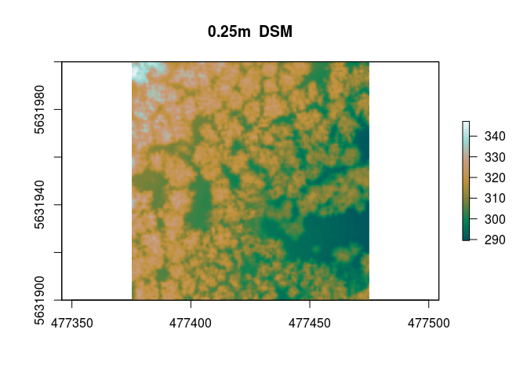

Creating a UAV based Digital Surface Model from RGB imagery derived point clouds
================

Digital Surface Models
----------------------

Digital Surface Models (DSMs) are very useful and common data sets in numerous spatial and environmental problems such as ecological, hydrological or meteorological and so on. High resolution DSM/DTM are nowadays usually derived from LiDAR data. However this is expensive and not always and everywhere available. Lowest Budget ready to fly unmanned vehicles (rtf-UAVs) are very suitable to close this gap for a fast and reasonable retrieval of imagery data and and as a derivative of it dense point clouds (DPCs).

Prerequisites
-------------

To derive Orthoimages or point clouds one can use between different tools the tutorial data is produced using [Agisoft Photoscan](http://www.agisoft.com) which is a great tool for deriving point clouds and all kind of surface models. In the end of the processing chain you will have an orthorectified image and a dense point cloud. We will use some UAV data from the Marburg Open Forest project.

First we have to set up the project. This is obviously more than usually due to the fact that a bunch of software needs to be linked against R.

``` r
require(uavRst)
```

    ## Loading required package: uavRst

``` r
require(raster)
```

    ## Loading required package: raster

    ## Loading required package: sp

``` r
require(mapview)
```

    ## Loading required package: mapview

``` r
# proj subfolders
projRootDir<-setwd(tempdir())
paths<-link2GI::initProj(projRootDir = projRootDir,
                         projFolders = c("data/","data/ref/","output/","run/","las/"),
                         global = TRUE,
                         path_prefix = "path_")


url <- "https://github.com/gisma/gismaData/raw/master/uavRst/lidar_477375_00_5631900_00_477475_00_5632000_00.las"
res <- curl::curl_download(url, "lasdata.las")
giLinks<-linkBuilder()
```

    ## 1

First attempt
-------------

Original resolution without filtering.

``` r
dsm1 <- uavRst::pc2dsm(lasDir = "lasdata.las",
                      gisdbase_path = projRootDir,
                      grid_size = ".02",
                      GRASSlocation = "dsm",
                      grass_lidar_method = "mean",
                      giLinks = giLinks)
```

    ## :: calculate DSM...
    ## :: convert raw DSM to GeoTiff 
    ## :: fill no data... 
    ## :: smoothing the gap filled DSM... 
    ## :: calculate metadata ...

``` r
pal = mapviewPalette("mapviewTopoColors")
raster::plot(dsm1[[1]],col = pal(100), main ="0.02m  DSM")
```


Second attempt
--------------

0.25 meter resolution without filtering.

``` r
dsm2 <- uavRst::pc2dsm(lasDir = "lasdata.las",
                      gisdbase_path = projRootDir,
                      grid_size = ".25",
                      GRASSlocation = "dsm",
                      grass_lidar_method = "mean",
                      giLinks = giLinks)
```

    ## :: calculate DSM...
    ## :: convert raw DSM to GeoTiff 
    ## :: fill no data... 
    ## :: smoothing the gap filled DSM... 
    ## :: calculate metadata ...

``` r
pal = mapviewPalette("mapviewTopoColors")
raster::plot(dsm2[[1]],col = pal(100), main ="0.25m  DSM")
```



Third attempt
-------------

we want to have a coarser and smoother result, so we can change the filter and resolution options.

``` r
dsm3 <- uavRst::pc2dsm(lasDir = "lasdata.las",
                      gisdbase_path = projRootDir,
                      type_smooth = "gauss",
                      otb_gauss_radius ="3",
                      grid_size = "2",
                      GRASSlocation = "dsm",
                      grass_lidar_method = "mean",
                      giLinks = giLinks)
```

    ## :: calculate DSM...
    ## :: convert raw DSM to GeoTiff 
    ## :: fill no data... 
    ## :: smoothing the gap filled DSM... 
    ## :: calculate metadata ...

``` r
pal = mapviewPalette("mapviewTopoColors")
raster::plot(dsm3[[1]],col = pal(100), main ="2m  DSM smoothed")
```


